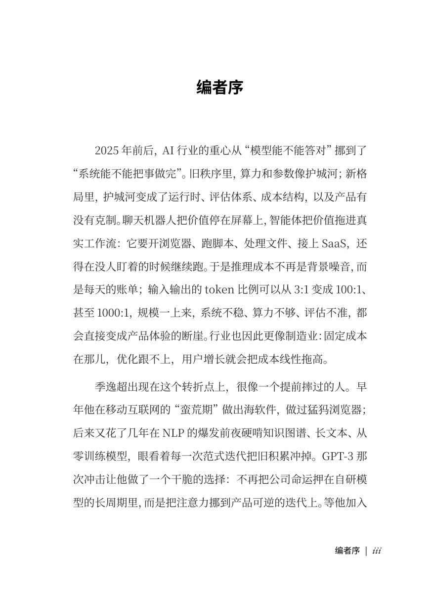
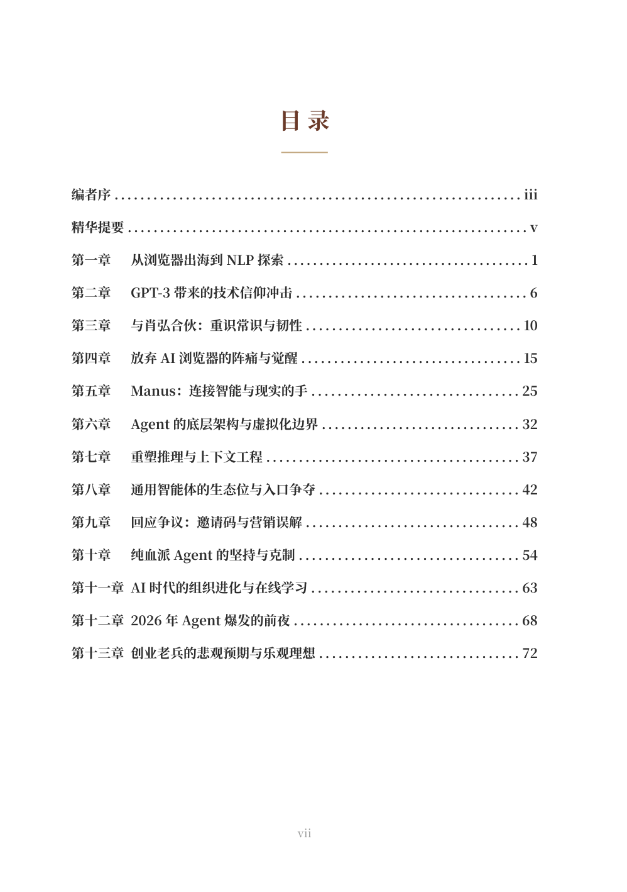
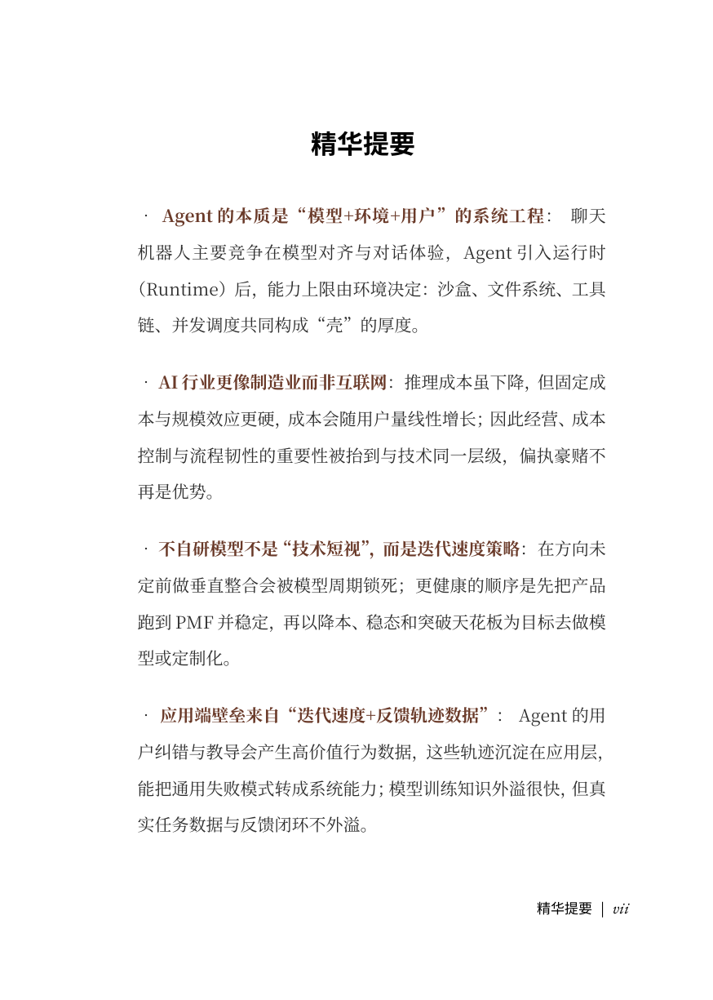
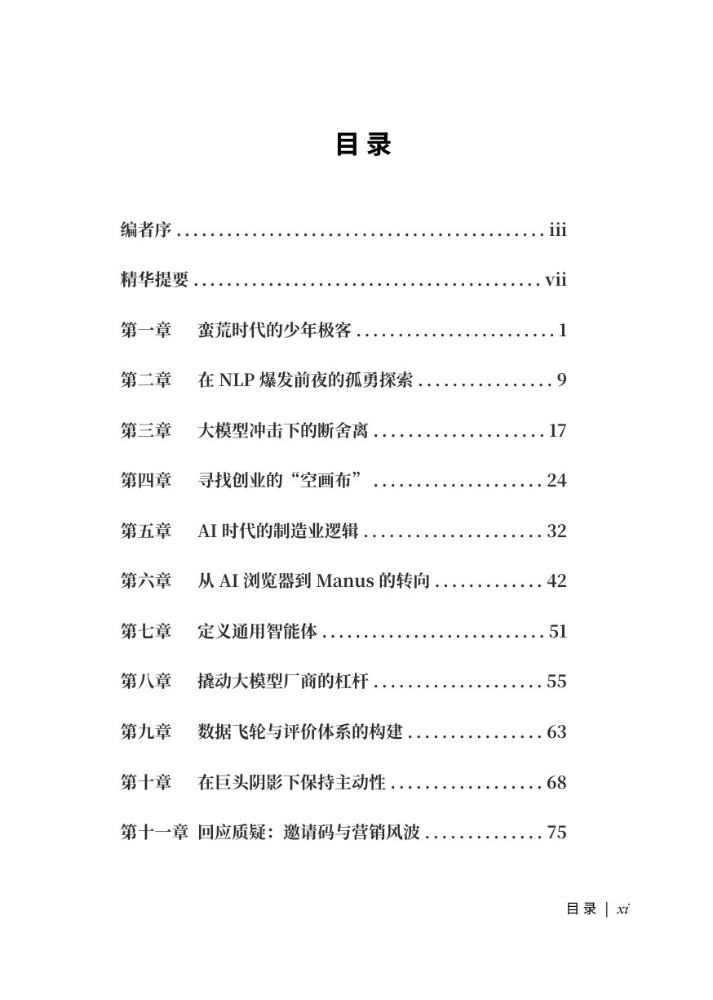
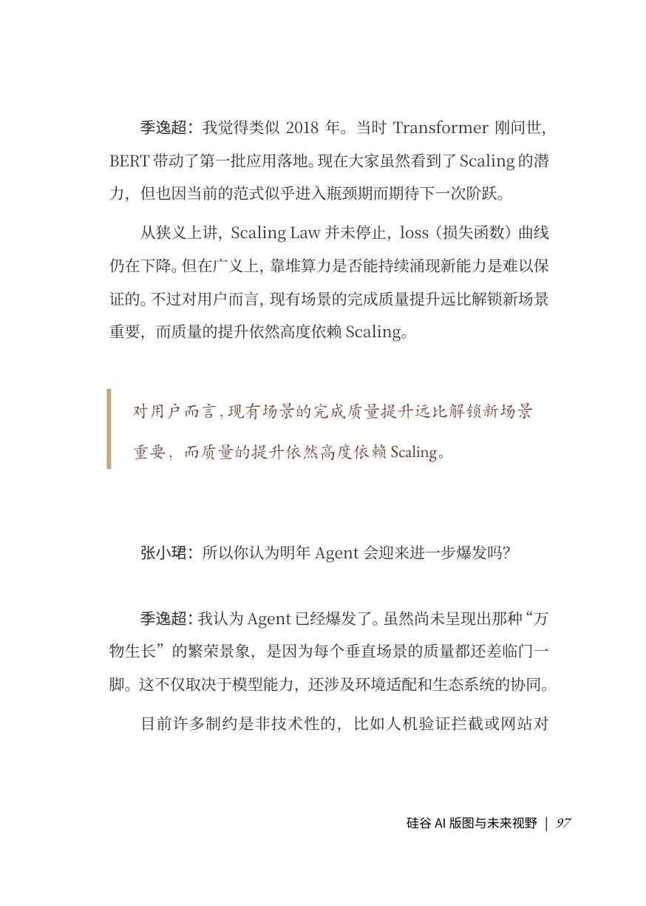
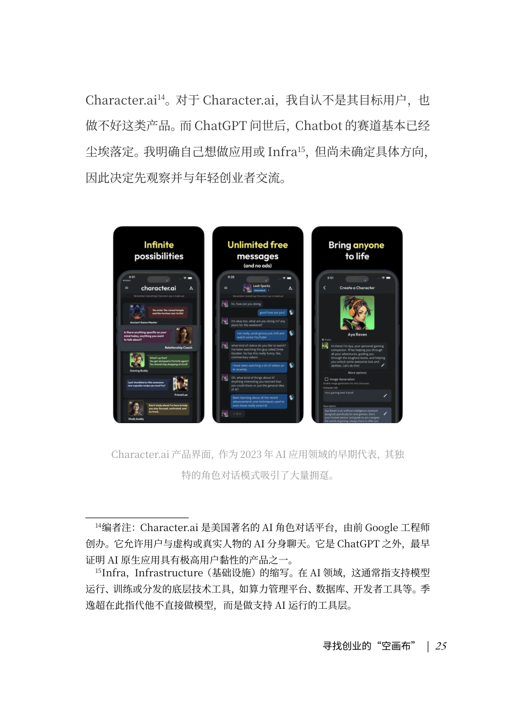

# podcast-to-book

把播客变成一本可印刷的书。支持两种工作流：

- **单期播客 → 书**：上传一条小宇宙 / Apple Podcasts 链接，自动转录、整理、排版，导出 PDF / EPUB / DOCX
- **多期播客 → 书**：把同一档播客的多期合并成一整本书（CLI 工作台，给运营/编辑使用）

底层是 LangGraph 工作流 + 任意 OpenAI 兼容的 LLM + 阿里通义 / 腾讯云 ASR + typst 排版。

## 项目结构

```
backend/
├── core/        # 共享引擎：workflow（LangGraph）+ 服务（LLM / ASR / 封面 / 节目解析）
├── single/      # 单期 → 书：FastAPI Web 服务
└── multi/      # 多期 → 书：CLI 工作台（"workbench"）

frontend/        # 单期版 Web UI（React + Ant Design + Vite）
```

## 快速开始（单期 Web 版）

### 1. 准备 Python + Node 环境

```bash
# Python 3.11+
cd backend
python -m venv venv
source venv/bin/activate
pip install -r requirements.txt

# Node 20+
cd ../frontend
npm install
```

### 2. 配置环境变量

```bash
cp backend/.env.example backend/.env
# 编辑 backend/.env，填入 LLM API key 和 ASR API key
```

最少需要的几个 key：
- `OPENAI_API_KEY` + `OPENAI_BASE_URL` —— 任何 OpenAI 兼容的服务（DeepSeek 推荐，便宜）
- `TENCENT_SECRET_ID` + `TENCENT_SECRET_KEY` —— 腾讯云语音识别（ASR）
- `COS_BUCKET` + `COS_REGION` —— 腾讯云对象存储（ASR 大文件中转，超过 5MB 必需）

去哪里办：
- DeepSeek：https://platform.deepseek.com/api_keys
- 腾讯云 ASR：https://console.cloud.tencent.com/asr （开通"语音识别"）
- 腾讯云 CAM：https://console.cloud.tencent.com/cam/capi （创建 SecretId/Key）
- 腾讯云 COS：https://console.cloud.tencent.com/cos/bucket （新建桶，记下 bucket 名 + region）

### 3. 启动

```bash
# 后端
cd backend
PYTHONPATH=. uvicorn single.main:app --reload --port 8000

# 前端
cd frontend
npm run dev
```

打开 http://localhost:5173

## 成品预览

<p>
  
  
  
</p>

<p>
  
  
  
</p>

## 多期工作流（multi 工作台）

`backend/multi/` 是一套命令行工具，把多期播客的转录稿合并成一整本书。流程比 Web 版精细得多（人工干预每个节点的结果，再喂给下一节点）。

```bash
cd backend
PYTHONPATH=. python -m multi.runners.run_pipeline --help
```

详见 [backend/multi/README.md](backend/multi/README.md)。

## 部署

`docker-compose.yml` 提供单容器部署。生产环境建议把 `DATABASE_URL` 切到 Postgres、`STORAGE_DIR` 挂卷。

## 开发

- 后端测试：`cd backend && PYTHONPATH=. pytest`
- 前端：`cd frontend && npm run build`
- 工作流节点都在 `backend/core/workflow/nodes/`，prompts 在 `backend/core/workflow/prompts/`

## License

[AGPL-3.0](LICENSE)。如果你把这个项目改造后通过网络服务的方式提供给别人使用，需要同样以 AGPL-3.0 公开你的源码。

需要其他 license（比如闭源商业用途）请联系作者。

## 致谢

- typst —— 排版引擎
- LangGraph —— 工作流框架
